# EDA Report — COMM5000 Milestone 1: Used Car Price (India)

| | |
|---|---|
| **File dữ liệu** | `[22_9] COMM5000-Used_Car_Price_Prediction.xlsm`, sheet `DATA` (không sửa file gốc: mã SHA-256 trước và sau khi chạy giống nhau) |
| **Trạng thái dữ liệu** | ⚠️ **CHƯA randomize.** Ô `Dataset!B6` trống. Bạn đã chọn làm EDA trên file này (xem [Những điều cần tôi quyết định](#những-điều-cần-tôi-quyết-định), mục 1) |
| **Tái lập kết quả** | `bash scripts/run_all.sh` (khoảng 66 giây). Log từng bước: `logs/`. Nhật ký script: [`script_log.md`](script_log.md) |
| **Quy ước** | "view **all**" = toàn bộ 1,005,000 dòng. "view **clean**" = bỏ 5,000 bản sao duplicate và 9,655 dòng implausible (còn 990,395 dòng). "view **clean_nofloor**" = view clean bỏ thêm các dòng có giá sàn (còn 874,592 dòng). Các view chỉ tạo trong bộ nhớ để **so sánh độ nhạy**; chúng **không phải** quyết định làm sạch dữ liệu. |
| **Seed / sampling** | `SEED = 5000`. Chỉ scatter ở fig_05b dùng sample (n = 5,000). Mọi thống kê và các hình còn lại dùng toàn bộ dữ liệu. |

---

## 0. Bước 0 — Kiểm tra file *(script: `00_load_and_inspect.py`)*

| Hạng mục | Kết quả |
|---|---|
| Sheet | `Dataset` (vùng B3:S7) là **mô tả / data dictionary gốc**, gồm 5 dải merged cells (B3:S3 … B7:S7). `DATA` (vùng A1:T1005001) là **dữ liệu chính**. |
| Header | Dòng 1 của `DATA`. Không có dòng tiêu đề hay ghi chú thừa, không có cột trống, không có merged cell trong `DATA`. |
| Nội dung ô | 1,005,000 dòng × 20 cột. 7,035,020 ô chuỗi (shared string), **0 công thức, 0 ô lỗi, 0 dòng ẩn**. Có 241,196 ô trống (= NaN). Có một AutoFilter cũ trên cột O (`_FilterDatabase`), không ảnh hưởng tới dữ liệu. |
| Macro / VBA | **Có** (`xl/vbaProject.bin`). Tôi chỉ liệt kê bằng olevba, **không chạy**. Module `ThisWorkbook` có `Workbook_Open` (AutoExec): nếu `Dataset!B6` trống thì gọi `RandomizeData`, macro này **ghi đè 5 cột D, E, F, L, T** (Mileage_kmpl, Engine_CC, Horsepower, Kms_Driven, Car_Price) bằng giá trị mô phỏng, rồi ghi thông báo vào B6. Mã nguồn đầy đủ: `tables/00_vba_source.txt`. |
| Trạng thái randomize | **B6 trống.** Metadata cho biết người lưu file cuối là giảng viên, ngày 07/09/2026. Như vậy macro chưa từng chạy trên file này. |
| Cách đọc | `pandas.read_excel(engine="calamine")` đọc toàn bộ file trong **12.7 giây** (openpyxl ước tính khoảng 0.9 phút). Dữ liệu được lưu sang **`data_interim.parquet`** (40 MB, **chưa làm sạch**). Đọc lại parquet chỉ mất khoảng 0.1 giây và **khớp 100%** với dữ liệu đọc từ xlsm. `load_raw()` kiểm tra đường dẫn, kích thước và mtime của file nguồn, nên không bao giờ dùng nhầm parquet cũ. |
| Kiểu lưu trữ | Mọi ô trong cột numeric đều là số; mọi ô trong cột categorical đều là chuỗi. **Không có số bị lưu dạng text**, không có đơn vị lẫn trong số. |

**Tóm tắt cấu trúc:** file có 1 bảng phẳng (1,005,000 × 20) ở sheet `DATA`, kèm 1 sheet mô tả. Dữ liệu đọc được trực tiếp, không cần xử lý header. Rủi ro lớn nhất không nằm ở định dạng mà ở **macro randomize chưa được áp dụng**.

---

## 1. Xác định mục tiêu

- **Câu hỏi kinh doanh.** Dự đoán market price của một xe cũ tại thời điểm appraisal, để marketplace có thể: đưa ra instant cash offer, flag các tin under-priced / over-priced, và dự báo inventory turnover. Đồng thời xác định **brand segment (Luxury = Audi, BMW, Mercedes; còn lại là Non-luxury)** có ảnh hưởng tới giá không.
- **Biến mục tiêu:** `Car_Price` (Rupees, theo sheet mô tả).
- **Đơn vị phân tích:** file không có cột ID. **GIẢ ĐỊNH 1 dòng = 1 listing.** Có 5,000 cặp dòng trùng hoàn toàn (Mục 3.5), nên sau khi bỏ bản sao, số listing duy nhất là 1,000,000.
- **EDA cần trả lời, để phục vụ M2 và final report:**
  1. Dữ liệu có những lỗi gì, lỗi ở mức nào, và nên xử lý thế nào? (Mục 3, 5, 10)
  2. Giá liên quan thế nào tới **Registration_Age** và **Kms_Driven**? Đây là câu hỏi (1) của Guide. (Mục 6–8)
  3. Luxury và Non-luxury khác nhau thế nào về mức giá và về *cách* giá thay đổi theo tuổi xe và số km? Đây là câu hỏi (2) của Guide, và là gợi ý cho interaction effect ở M2. (Mục 7)
  4. Biến nào đáng đưa vào mô hình, biến nào không, và cần cảnh báo multicollinearity ở đâu? (Mục 6, 10)

---

## 2. Cấu trúc dữ liệu *(script: `01_structure.py`; bảng đầy đủ: `tables/01_data_dictionary.csv`)*

1,005,000 dòng × 20 cột (19 biến đầu vào + 1 target). Ý nghĩa của biến lấy từ sheet `Dataset`. Những điểm tôi tự suy ra được ghi là **GIẢ ĐỊNH**.

| Biến | Kiểu thực tế | Kiểu nên có | Nhóm biến | Unique | NaN | Ví dụ / miền giá trị | Ý nghĩa · ghi chú |
|---|---|---|---|---:|---:|---|---|
| Brand | str | category | categorical – nominal | 26 (13 sau chuẩn hóa) | 0 | 'BMW', ' BMW ' | Hãng xe; dùng để tạo Segment |
| Model | str | category | categorical – nominal | 39 | 0 | 'Verna', '3 Series' | Mỗi Brand có đúng 3 Model |
| Year | int64 | int | numeric – discrete (thời gian) | 25 | 0 | 2000–2024 | Năm sản xuất |
| Mileage_kmpl | float64 | float | numeric – continuous | 919,489 | 80,390 | 5.0–36.3 (median 18.0) | km/l |
| Engine_CC | float64 | float | numeric – continuous | 883,162 | 80,403 | 800–3,362 (median 1,500) | cc; có phần thập phân |
| Horsepower | float64 | float | numeric – continuous | 920,000 | 80,403 | −18.5–290.2 (median 120.1) | GIẢ ĐỊNH đơn vị là hp (mô tả gốc không ghi) |
| Fuel_Type | str | category | categorical – nominal | 12 (6 sau chuẩn hóa) | 0 | 'Petrol', 'PETROL', 'hybridd' | |
| Transmission | str | category | categorical – nominal | 3 | 0 | Manual / Automatic / Unknown | |
| Owner_Type | str | ordered category | categorical – ordinal | 4 | 0 | First < Second < Third < Fourth+ | Thứ tự suy ra từ nhãn |
| Color | str | category | categorical – nominal | 8 | 0 | 'Red', 'Unknown' | |
| City | str | category | categorical – nominal | 9 | 0 | 'Delhi', 'Unknown' | Mô tả gốc: *registration* city |
| Kms_Driven | int64 | int | numeric – continuous | 252,585 | 0 | 5,000–4,368,000 (median 166,313) | GIẢ ĐỊNH đơn vị là km |
| Insurance_Valid | int64 | bool | categorical – binary | 2 | 0 | 0/1 (84.9% bằng 1) | GIẢ ĐỊNH 1 = còn hiệu lực |
| Service_History | int64 | bool | categorical – binary | 2 | 0 | 0/1 (75.1% bằng 1) | GIẢ ĐỊNH 1 = có hồ sơ bảo dưỡng |
| Accidents | int64 | int | numeric – discrete (count) | 6 | 0 | 0–5 | Số vụ tai nạn được báo cáo |
| Tax_Paid | int64 | bool | categorical – binary | 2 | 0 | 0/1 (90.0% bằng 1) | GIẢ ĐỊNH 1 = đã nộp road tax |
| Number_of_Doors | int64 | int | numeric – discrete | 3 | 0 | 2 / 4 / 5 | |
| Seats | int64 | int | numeric – discrete | 4 | 0 | 2 / 4 / 5 / 7 | |
| Registration_Age | int64 | int | numeric – discrete | 25 | 0 | 1–25 | GIẢ ĐỊNH đơn vị là năm; **= 2025 − Year ở 100% dòng** |
| **Car_Price** | float64 | float | numeric – continuous (**TARGET**) | 883,005 | 0 | 50,000–37,885,998 (median 758,908) | Rupees |

**Phân loại biến:**
- Numeric continuous (5): Mileage_kmpl, Engine_CC, Horsepower, Kms_Driven, Car_Price.
- Numeric discrete (5): Year, Registration_Age, Accidents, Number_of_Doors, Seats.
- Binary (3): Insurance_Valid, Service_History, Tax_Paid.
- Categorical nominal (6): Brand, Model, Fuel_Type, Transmission, Color, City.
- Categorical ordinal (1): Owner_Type.
- Date/time: không có cột ngày. Year là biến thời gian duy nhất.
- ID/text: không có.

---

## 3. Chất lượng dữ liệu *(script: `02_data_quality.py`; bảng: `tables/02*.csv`)*

### 3.1 Missing values (NaN thật)

| Cột | NaN | % |
|---|---:|---:|
| Mileage_kmpl | 80,390 | 7.999% |
| Engine_CC | 80,403 | 8.000% |
| Horsepower | 80,403 | 8.000% |
| 17 cột còn lại | 0 | 0% |

- **Số liệu.**
  - 222,503 dòng (22.14%) có ít nhất 1 NaN.
  - Mẫu hình missing khớp gần như tuyệt đối với giả định "mỗi ô thiếu độc lập với xác suất 8%":
    - thiếu đúng 1 cột: khoảng 68,000 dòng mỗi cột (kỳ vọng 68,050);
    - thiếu 2 cột: 5,779–6,031 dòng (kỳ vọng 5,917);
    - thiếu cả 3 cột: **515 dòng (kỳ vọng 514)**.
  - Tỉ lệ missing theo City, Brand, Segment, Year, Fuel, Transmission, Owner chỉ chênh tối đa **0.67 điểm %** giữa các nhóm.
  - Median Car_Price của dòng thiếu và dòng đủ chênh ≤ 0.71% (lớn nhất ở Engine_CC: 753,962 so với 759,370).
- **Diễn giải.** Missing có dạng **MCAR-like**: không tập trung theo nhóm nào và không liên quan tới giá. Điều này khớp với ghi chú trên sheet `Dataset`: *"Missing values are addressed by the randomising script…"*.
- **Hệ quả.** Nên giữ dòng và dùng pairwise deletion (bỏ ô trống riêng cho từng thống kê). Không cần impute ở M1.

### 3.2 'Unknown' và các biến thể (tách khỏi NaN)

| Cột | 'Unknown' | % | Biến thể khác ('unknown', 'N/A', '-', '', chuỗi toàn khoảng trắng) |
|---|---:|---:|---:|
| Fuel_Type | 78,733 | 7.834% | 0 |
| Transmission | 80,385 | 7.999% | 0 |
| Color | 80,419 | 8.002% | 0 |
| City | 80,430 | 8.003% | 0 |
| Brand, Model, Owner_Type | 0 | 0% | 0 |

- **Số liệu.**
  - 283,648 dòng (28.22%) có ít nhất 1 'Unknown'. Con số kỳ vọng nếu độc lập là 1 − 0.92⁴ = 28.4%.
  - % Unknown theo City, Brand, Segment, Year chênh tối đa 0.67 điểm %.
  - Median giá chênh ≤ 0.27%.
  - **Tổng hợp: 443,543 dòng (44.13%) có NaN hoặc Unknown.**
- **Số 0 / số âm vô nghĩa.** Không có số 0 ở bất kỳ biến nào phải dương. Số 0 của Accidents là giá trị hợp lệ. **Horsepower có 32 giá trị âm** (min −18.51).
- **Diễn giải.** 'Unknown' là cách file mã hóa missing cho biến categorical, và cũng ngẫu nhiên như NaN.
- **Hệ quả.** Giữ 'Unknown' như một nhóm riêng. Nếu xóa (listwise deletion) thì mất 44% dữ liệu mà kết quả không đổi (xem Mục 9).

### 3.3 Inconsistent category labels — bảng mapping đề xuất *(`tables/02c_label_mapping_proposed.csv`; fig_03e)*

Quy tắc đề xuất:
- **R2:** TRIM khoảng trắng và gộp các nhãn chỉ khác nhau về hoa/thường; lấy dạng viết phổ biến nhất làm nhãn chuẩn.
- **R3:** với nhãn hiếm (< 1% cột), gộp vào nhãn phổ biến có độ giống ≥ 0.8 (difflib).

| Biến | Nhãn gốc (repr) | → Nhãn chuẩn | Quy tắc | Số dòng |
|---|---|---|---|---:|
| Brand | `' Mercedes '` | Mercedes | R2 trim | 813 |
| Brand | `' BMW '` | BMW | R2 trim | 788 |
| Brand | `' Audi '` | Audi | R2 trim | 733 |
| Brand | `' Nissan '`, `' Skoda '`, `' Mahindra '`, `' Tata '`, `' Honda '`, `' Kia '`, `' Hyundai '`, `' Toyota '`, `' Ford '`, `' Volkswagen '` | tên tương ứng (đã trim) | R2 trim | 744–792 mỗi nhãn; tổng 7,706 |
| Fuel_Type | `' Diesel'`, `'diesel '` | Diesel | R2 trim/case | 3,390 + 3,373 |
| Fuel_Type | `'petrol'`, `'PETROL'` | Petrol | R2 case | 3,351 + 3,317 |
| Fuel_Type | `'hybridd'` | Hybrid | R3 typo | 3,423 |
| Fuel_Type | `'electrik'` | Electric | R3 typo | 3,269 |

- **Số liệu.**
  - Brand: 26 → 13 nhãn; 10,040 dòng bị ảnh hưởng (0.999%).
  - Fuel_Type: 12 → 6 nhãn; 20,123 dòng (2.00%), trong đó 6,692 dòng là typo.
  - Model, Transmission, Owner_Type, Color, City: không có lỗi nhãn.
- **Luxury bị ảnh hưởng trực tiếp.** Có 2,334 dòng `' Audi '`, `' BMW '`, `' Mercedes '`. **Nếu không TRIM, các dòng này sẽ bị xếp nhầm vào Non-luxury.** Khi đó tỉ trọng Luxury là 22.87% thay vì 23.10%.
- **Hệ quả.** TRIM Brand là **bắt buộc** trước khi tạo Segment (Guide cũng nhấn mạnh điểm này). Với Fuel_Type, typo cần được bạn xác nhận (xem mục quyết định).

### 3.4 Nhất quán Model–Brand
- **Số liệu.** 39 Model, mỗi Brand có đúng 3 Model (ví dụ Audi: A4, Q3, Q5). **Không có Model nào gắn với hơn 1 Brand.** Không có Brand 'Unknown'.
- **Hệ quả.** Có thể dùng Model để kiểm tra chéo Brand. Model không cho thêm thông tin về giá ngoài Brand: trong cùng một Brand, median giá của các Model chỉ chênh ≤ 2.8% (Mục 8).

### 3.5 Duplicated records *(`tables/02e_*.csv`)*

| Định nghĩa | Dòng thuộc nhóm trùng | Bản sao thừa | % |
|---|---:|---:|---:|
| E1: trùng hoàn toàn 20 cột (nhãn gốc) | 10,000 | 5,000 | 0.498% |
| E2: trùng 20 cột sau khi chuẩn hóa nhãn | 10,000 | 5,000 | 0.498% |
| E3: trùng mọi cột trừ Car_Price | 10,000 | 5,000 | 0.498% |

- **Số liệu.**
  - Mọi nhóm trùng đều có đúng 2 dòng.
  - Không có near-duplicate nào ngoài các exact duplicate (E2 và E3 không thêm dòng mới).
  - Các bản sao nằm rải rác trong file (dòng Excel 8,603 → 1,004,834).
  - Ví dụ: dòng Excel **5208** và **346517** giống nhau hoàn toàn (Audi A4 2022, Engine_CC 1910.868615, Car_Price 1,961,442).
- **Diễn giải.** Hai dòng trùng tới cả 5 biến số thực có nhiều chữ số thập phân thì gần như không thể là ngẫu nhiên. Sau khi bỏ bản sao, số dòng còn **đúng 1,000,000**, cho thấy 5,000 bản sao được *chèn thêm* vào dữ liệu.
- **Hệ quả.** Đề xuất xóa 5,000 bản sao. Ảnh hưởng tới thống kê không đáng kể: median giá chỉ thay đổi 0.007%.

### 3.6 Kiểu dữ liệu và tính nhất quán nội tại
- Không có số lưu dạng text, không có đơn vị lẫn trong số. Các biến nhị phân chỉ nhận giá trị {0, 1}.
- **Year + Registration_Age = 2025 ở 100% dòng.**
  - Suy ra: **GIẢ ĐỊNH năm tham chiếu (năm thu thập dữ liệu) là 2025.**
  - Không có xe nào có năm sản xuất sau năm tham chiếu (Year max là 2024).
  - Hệ quả: Year và Registration_Age là **cùng một thông tin** (r = −1).
- **Point mass tại giá trị nhỏ nhất (dấu hiệu bị chặn sàn / censoring):**

| Biến | Giá trị sàn | Số dòng | % | Giá trị kế tiếp phía trên |
|---|---:|---:|---:|---:|
| Car_Price | 50,000 | **116,375** | **11.58%** | 50,000.86 |
| Engine_CC | 800 | 37,028 | 4.00% số giá trị có | 800.008 |
| Mileage_kmpl | 5 | 516 | 0.06% | 5.005 |

- **Diễn giải.** Một biến continuous mà có hơn 116 nghìn dòng mang *đúng* một giá trị, và giá trị đó lại là min, thì gần như chắc chắn là **giá trị bị chặn**, không phải giá quan sát thật. Mục 5 phân tích sâu hơn.

---

## 4. Phân tích từng biến (univariate) *(script: `03_univariate.py`; bảng: `tables/03a_*.csv`, `03b_*.csv`, `03c_*.csv`)*

### 4.1 Numeric — thống kê đầy đủ (view all, dữ liệu thô)

| Biến | n | Mean | Median | SD | Min | Q1 | Q3 | Max | IQR | Skew | Kurt (excess) |
|---|---:|---:|---:|---:|---:|---:|---:|---:|---:|---:|---:|
| Car_Price | 1,005,000 | 1,012,897 | 758,908 | 1,141,645 | 50,000 | 343,350 | 1,293,475 | 37,885,998 | 950,125 | **6.99** | **116.5** |
| Kms_Driven | 1,005,000 | 202,864 | 166,313 | 175,371 | 5,000 | 84,555 | 286,380 | 4,368,000 | 201,825 | **4.64** | **57.0** |
| Registration_Age | 1,005,000 | 13.00 | 13 | 7.21 | 1 | 7 | 19 | 25 | 12 | 0.00 | −1.20 |
| Engine_CC | 924,597 | 1,506.6 | 1,500.2 | 386.0 | 800 | 1,230.4 | 1,769.6 | 3,362.0 | 539.2 | 0.20 | −0.32 |
| Horsepower | 924,597 | 120.57 | 120.05 | 36.78 | −18.51 | 94.84 | 145.48 | 290.25 | 50.64 | 0.11 | −0.16 |
| Mileage_kmpl | 924,610 | 18.00 | 18.00 | 3.99 | 5.00 | 15.30 | 20.69 | 36.28 | 5.39 | 0.00 | −0.02 |
| Accidents | 1,005,000 | 0.30 | 0 | 0.55 | 0 | 0 | 1 | 5 | 1 | 1.83 | 3.31 |

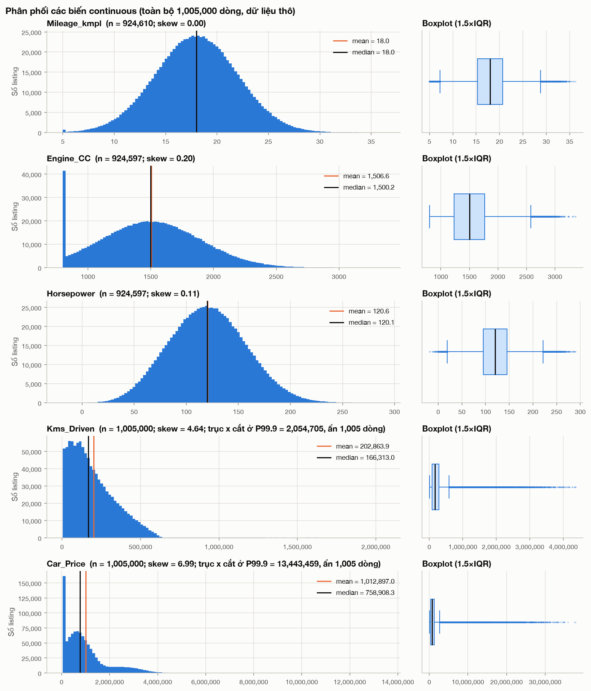

- **Car_Price.**
  - *Số liệu:* mean cao hơn median **33.5%** (1,012,897 so với 758,908); skew 6.99; chỉ 36.1% số listing có giá cao hơn mean. Histogram có một cột cao đột biến ở 50,000 và hai "bướu" giá (khoảng 0.7M và 2–3M).
  - *Diễn giải:* phân phối **lệch phải mạnh**. Mean bị kéo lên bởi đuôi phải (một phần do Luxury, một phần do dữ liệu lỗi ở Mục 5), nên median mới phản ánh "chiếc xe điển hình".
  - *Hệ quả:* **nên báo cáo median cho khách hàng.** Cân nhắc dùng log(price) cho phân tích (Mục 7.1).
- **Kms_Driven.**
  - *Số liệu:* skew 4.64; max 4.37 triệu km.
  - *Diễn giải:* phần thân lệch phải vừa phải, nhưng đuôi rất dài do một nhóm giá trị bất thường (Mục 5).
  - *Hệ quả:* xử lý nhóm bất thường trước khi tính correlation.
- **Engine_CC, Horsepower, Mileage_kmpl.**
  - *Số liệu:* gần đối xứng (|skew| ≤ 0.2).
  - *Diễn giải:* phân phối có dạng gần như chuông. Có hai ngoại lệ: cột 800 cao đột biến của Engine_CC và các giá trị âm của Horsepower.
  - *Hệ quả:* không cần biến đổi các biến này.
- **Year và Registration_Age.**
  - *Số liệu:* phân phối **đều**, mỗi năm 3.97–4.04% số dòng (kurtosis −1.2).
  - *Diễn giải / hệ quả:* xem Mục 9 về tính đại diện.

### 4.2 Bảng theo mẫu Assessment Guide: Entire / Luxury / Non-luxury (view all; Segment dựa trên Brand đã TRIM)

n: Entire = 1,005,000 · Luxury = 232,172 (23.10%) · Non-luxury = 772,828 (76.90%)

| Biến | Nhóm | Mean | Mode | Median | SD | Min | Max |
|---|---|---:|---:|---:|---:|---:|---:|
| **Car_Price** | Entire | 1,012,897 | 50,000* | 758,908 | 1,141,645 | 50,000 | 37,885,998 |
| | Luxury | **2,263,045** | 50,000* | **2,155,953** | 1,551,251 | 50,000 | 37,885,998 |
| | Non-luxury | **637,329** | 50,000* | **581,505** | 601,181 | 50,000 | 16,183,316 |
| **Registration_Age** | Entire | 13.00 | 6 | 13 | 7.21 | 1 | 25 |
| | Luxury | 13.02 | 18 | 13 | 7.21 | 1 | 25 |
| | Non-luxury | 13.00 | 19 | 13 | 7.21 | 1 | 25 |
| **Kms_Driven** | Entire | 202,864 | 117,600† | 166,313 | 175,371 | 5,000 | 4,368,000 |
| | Luxury | 202,962 | 124,080† | 166,376 | 176,006 | 5,000 | 4,344,375 |
| | Non-luxury | 202,834 | 146,160† | 166,291 | 175,179 | 5,000 | 4,368,000 |
| Engine_CC | Entire / Lux / Non | 1,506.6 / 1,506.6 / 1,506.6 | 800* | 1,500.2 / 1,499.1 / 1,500.5 | 386.0 / 385.9 / 386.1 | 800 | 3,362.0 / 3,350.0 / 3,362.0 |
| Horsepower | Entire / Lux / Non | 120.57 / 120.53 / 120.58 | —† | 120.05 / 120.06 / 120.05 | 36.78 / 36.73 / 36.79 | −18.51 / −11.74 / −18.51 | 290.25 / 285.57 / 290.25 |
| Mileage_kmpl | Entire / Lux / Non | 18.00 / 17.98 / 18.00 | 5* | 18.00 / 17.99 / 18.00 | 3.99 | 5 | 36.28 / 35.72 / 36.28 |
| Accidents | cả 3 nhóm | 0.30 | 0 | 0 | 0.55 | 0 | 5 |
| Insurance_Valid / Service_History / Tax_Paid (tỉ lệ = 1) | cả 3 nhóm | 0.85 / 0.75 / 0.90 | 1 | 1 | — | 0 | 1 |

\* Mode trùng với **giá trị sàn** (Mục 3.6), nên không mô tả "giá trị điển hình".
† Với biến continuous, mode chỉ là một giá trị lặp 2–38 lần, **không có ý nghĩa**. Bảng đầy đủ: `tables/03b_guide_table_by_segment.csv`.

- **Số liệu.**
  - Median giá Luxury gấp **3.71 lần** Non-luxury (mean gấp 3.55 lần); chênh median là 1,574,449 Rs.
  - **Mọi biến khác gần như giống hệt nhau giữa hai segment**: tuổi xe, km, engine, HP, mileage, accidents, các biến nhị phân (mean chênh ≤ 0.2%; ví dụ Service_History 74.96% so với 75.11%).
- **Diễn giải.** Hai segment có cùng "hồ sơ xe", chỉ khác nhau về giá. Vì vậy, chênh lệch giá **không** đến từ việc xe Luxury cũ hơn hay chạy nhiều km hơn.
- **Hệ quả.** So sánh giá theo segment là "sạch" (không bị nhiễu bởi biến khác), rất thuận lợi cho kiểm định ở M2.

### 4.3 Categorical

| Biến | Số nhóm (chuẩn hóa) | Phân bố |
|---|---:|---|
| Brand | 13 | mỗi brand 7.66–7.72% |
| Model | 39 | mỗi model 2.54–2.59% |
| Fuel_Type | 6 | Petrol 41.2%, Diesel 27.7%, CNG 9.0%, Unknown 7.8%, Electric 7.5%, Hybrid 6.6% |
| Transmission | 3 | Manual 59.8%, Automatic 32.2%, Unknown 8.0% |
| Owner_Type | 4 | First 59.9%, Second 25.0%, Third 10.0%, Fourth+ 5.0% |
| Color | 8 | 7 màu, mỗi màu khoảng 13.1–13.2%; Unknown 8.0% |
| City | 9 | 8 city, mỗi city khoảng 11.4–11.5%; Unknown 8.0% |

- **Nhóm hiếm (< 1%).** Sau chuẩn hóa: **không có**. Với nhãn gốc: 19 nhãn hiếm, và **tất cả đều là biến thể lỗi** (13 nhãn Brand có khoảng trắng, 6 biến thể của Fuel_Type).
- **Biến rời rạc.** Accidents: 0 vụ 74.1%, 1 vụ 22.2%, 2 vụ 3.3%, 3–5 vụ 0.36%. Doors: 4 cửa 60.1%. Seats: 5 chỗ 75.0%.
- **Hệ quả.** Nhóm Accidents 3–5 có rất ít dòng (luxury chỉ 3 dòng ở 5 vụ), nên cần gộp lại (ví dụ thành "≥ 3") nếu dùng làm nhóm.

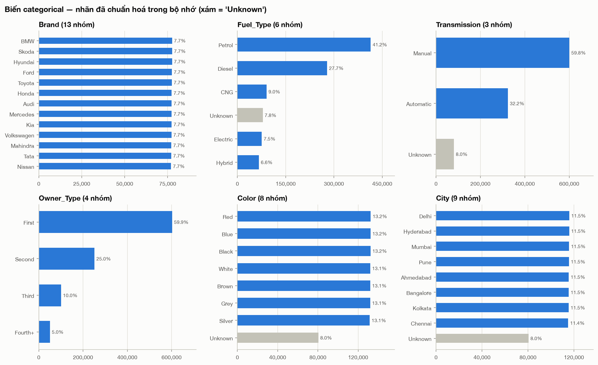
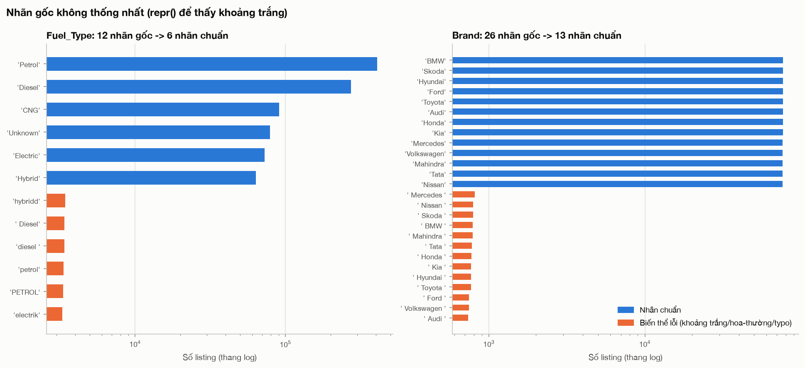

Các hình khác: `fig_03b_discrete_bars.png`, `fig_03d_model_bars.png`.

---

## 5. Phân tích ngoại lệ (outliers) *(script: `04_outliers.py`; bảng: `tables/04*.csv`)*

### 5.1 IQR vs z-score (view all)

| Biến | > 1.5×IQR | % | > 3×IQR | % | \|z\| > 3 | % |
|---|---:|---:|---:|---:|---:|---:|
| Car_Price | 70,413 | 7.01% | 5,843 | 0.58% | 4,780 | 0.48% |
| log(Car_Price) | 1,864 | 0.18% | 0 | 0% | 302 | 0.03% |
| Kms_Driven | 9,948 | 0.99% | 4,431 | 0.44% | 5,307 | 0.53% |
| Mileage_kmpl | 6,505 | 0.70% | 0 | 0% | 2,484 | 0.27% |
| Engine_CC | 3,223 | 0.35% | 0 | 0% | 1,647 | 0.18% |
| Horsepower | 4,005 | 0.43% | 0 | 0% | 1,708 | 0.18% |
| Accidents | 3,633 | 0.36% | 16 | 0.00% | 37,067 | 3.69% |

- **Diễn giải.**
  - Với biến lệch phải (Car_Price), quy tắc 1.5×IQR đánh dấu tới 7% số dòng là outlier. Nguyên nhân là các giá Luxury hợp lệ.
  - Quy tắc z-score thì không phù hợp với biến rời rạc: nó gắn cờ *mọi* xe có ≥ 2 tai nạn (3.69%).
  - Trên thang log, số outlier của giá giảm còn 0.18%.
- **Hệ quả.** Không nên dùng một ngưỡng thống kê duy nhất để xóa dữ liệu. Cần phân loại theo **logic nội tại** như ở 5.2.

### 5.2 Ba loại giá trị bất thường

**(a) Implausible, tức phi lý theo logic nội tại** (chỉ gắn cờ `imp_*`, không xóa)

| Quy tắc | Số dòng | % | % Luxury trong nhóm |
|---|---:|---:|---:|
| Kms_Driven > 1,000,000 (ví dụ trong Guide) | 3,908 | 0.389% | 23.1% |
| **Kms_Driven / Registration_Age > 25,000 km/năm** | **9,623** | **0.958%** | 23.2% |
| Horsepower ≤ 0 | 32 | 0.003% | 21.9% |
| Car_Price ≤ 0; Kms ≤ 0; Engine ≤ 0; Mileage ≤ 0; Year + Age ≠ 2025 | 0 | 0% | — |
| **Có ít nhất một cờ** | **9,655** | **0.961%** | 23.2% (bằng tỉ trọng chung 23.1%) |

- **Số liệu, phần Kms.**
  - Histogram Kms_Driven (fig_04c) có **điểm gãy rõ ở khoảng 620,000 km**: mật độ giảm khoảng 100 lần, sau đó là một nhóm phân bố phẳng kéo dài tới 4.4M.
  - Tính theo km mỗi năm tuổi (fig_04d), **99.04% dòng nằm gọn trong [5,000; 25,000)**, median 15,095.
  - 9,623 dòng vượt biên này. Nhóm này **bao gồm toàn bộ 3,908 dòng Kms > 1M**, và còn thêm 5,715 dòng có Kms ≤ 1M nhưng cùng kiểu bất thường.
- **Số liệu, phần giá.**
  - Giá của nhóm này **cao gấp 4.76 lần** (median) so với xe cùng Model và cùng tuổi. Ở phần còn lại, tỉ lệ này là 1.00.
  - Nhóm chiếm **81.5% số outlier giá > 3×IQR**.
  - Nhóm phân bố đều theo tuổi xe (3.6–4.3% mỗi tuổi) và theo segment.
- **Diễn giải.** Nhóm khoảng 0.96% này có *cả* Kms *lẫn* giá bị phóng đại, và tách biệt hẳn khỏi phần thân dữ liệu. Nhiều khả năng đây là "implausible extreme values" được cài vào (Guide có nhắc tới). Quy tắc > 1M của Guide chỉ bắt được **41%** số dòng này.
- **Hệ quả.**
  - Đề xuất loại nhóm này khi phân tích quan hệ giá. Khi đó correlation giá–Kms đổi từ −0.074 thành −0.335, và skew của giá giảm từ 6.99 xuống 2.06.
  - ⚠️ Quy tắc km/năm **chỉ đúng với file chưa randomize**, vì macro sẽ sinh lại Kms_Driven độc lập với tuổi xe.
- **Horsepower ≤ 0.** 32 dòng, và median Engine_CC của chúng đúng bằng 800 (giá trị sàn). Như vậy HP âm xuất hiện ở đúng những xe có Engine bị chặn sàn: Engine bị chặn nhưng HP (tương quan 0.84 với Engine) thì không bị chặn.

**(b) Extreme nhưng có thể hợp lệ**
- **Số liệu.**
  - Car_Price: 5,843 dòng vượt 3×IQR, trong đó 4,764 dòng nằm trong nhóm implausible, còn lại **1,079 dòng, và 85.7% là Luxury**.
  - Theo fence 1.5×IQR của toàn mẫu (2,718,663), **94.1% số outlier giá là xe Luxury**, và 28.5% xe Luxury bị gắn cờ.
  - Nếu tính fence **riêng trong từng segment** thì chỉ còn 0.91% (Luxury, fence 4,785,489) và 0.66% (Non-luxury, fence 1,965,598).
- **Hệ quả.** Outlier giá phải được đánh giá **trong từng segment**. Nếu dùng fence của toàn mẫu thì sẽ vô tình loại xe Luxury, gây bias cho chính câu hỏi (2).

**(c) Giá trị sàn (censored): Car_Price = 50,000**

| | Luxury | Non-luxury |
|---|---:|---:|
| % listing có giá = 50,000 | **0.05%** | **15.04%** |
| Ở xe 10 tuổi | 0.00% | 0.91% |
| Ở xe 20 tuổi | 0.01% | 31.80% |
| Ở xe 25 tuổi | 0.64% | **55.23%** |

- **Số liệu, theo quintile Kms:** tỉ lệ giá sàn là 0.01% ở nhóm thấp nhất và 36.3% ở nhóm cao nhất. Theo Fuel, Owner, City: 11.5–11.8% (không khác nhau). Theo Accidents: 11.3% (0 vụ) → 25% (5 vụ).
- **Diễn giải.** Giá sàn **không ngẫu nhiên**. Nó tập trung ở xe **Non-luxury, cũ, chạy nhiều km**, tức đúng những xe có giá thật thấp nhất. Có thể hiểu giá được tính rồi **bị chặn dưới ở 50,000**: giá thật ≤ 50,000 nhưng ta không biết chính xác bao nhiêu.
- **Hệ quả.**
  - **Không nên xóa** các dòng này (Mục 9 cho thấy xóa sẽ gây bias).
  - Nên giữ lại, gắn cờ, báo cáo median, và kiểm tra độ nhạy ở M2.
  - Cũng vì giá sàn này mà trên thang log, đường giá theo tuổi của Non-luxury bị cong xuống (fig_06e).

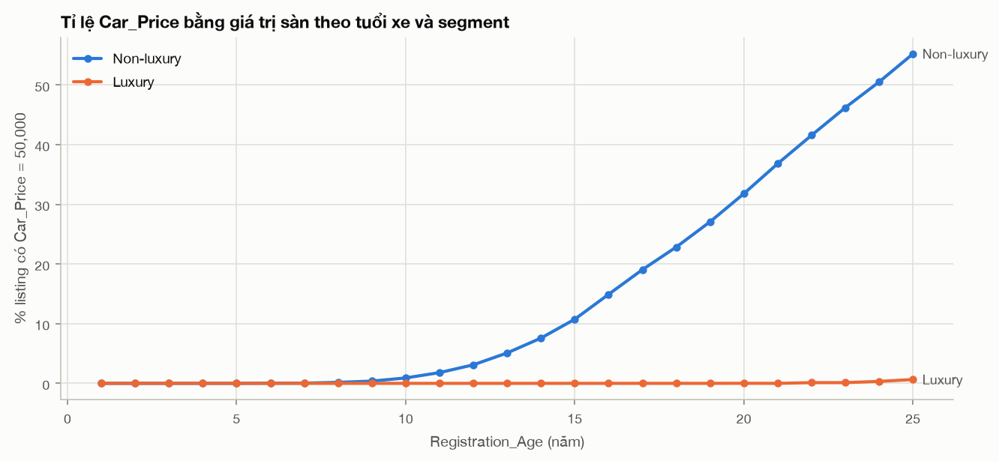
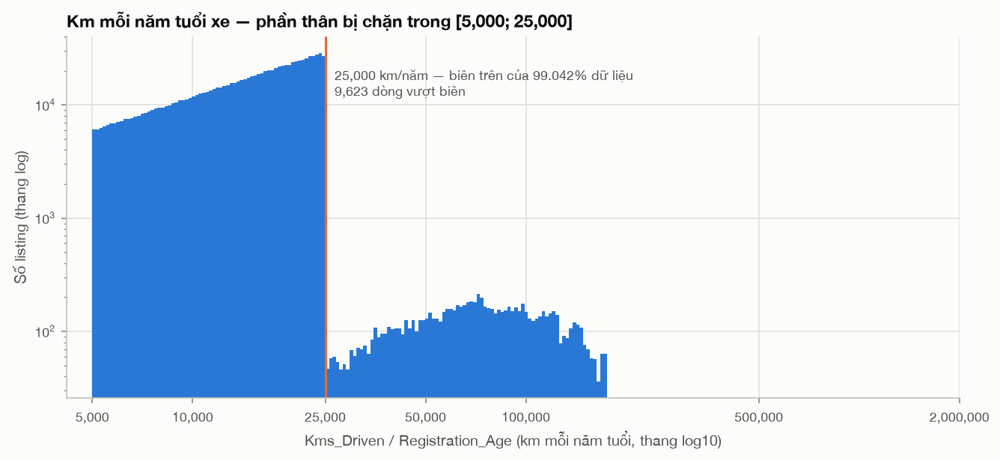

Các hình khác: `fig_04a_price_box_segment.png`, `fig_04c_kms_tail.png`.

---

## 6. Quan hệ giữa các biến *(script: `05_bivariate.py`; bảng: `tables/05*.csv`)*

### 6.1 Correlation (Pearson & Spearman)

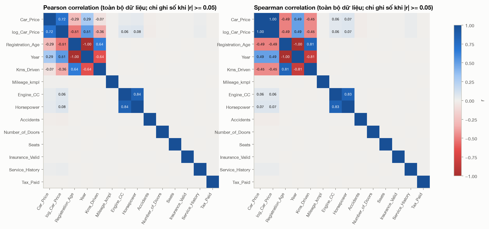

**Correlation của Car_Price với từng biến, theo 3 view (độ nhạy):**

| Biến | Pearson (all) | Pearson (clean) | Pearson (clean_nofloor) | Spearman (all) | Spearman (clean) | Spearman (clean_nofloor) |
|---|---:|---:|---:|---:|---:|---:|
| Registration_Age | −0.287 | −0.357 | −0.245 | −0.490 | −0.493 | −0.365 |
| Kms_Driven | **−0.074** | **−0.335** | −0.212 | −0.454 | −0.478 | −0.347 |
| Horsepower | 0.045 | 0.055 | 0.036 | 0.072 | 0.072 | 0.048 |
| Engine_CC | 0.037 | 0.046 | 0.030 | 0.060 | 0.061 | 0.041 |
| Service_History | 0.017 | 0.020 | 0.013 | 0.028 | 0.028 | 0.018 |
| Accidents | −0.010 | −0.013 | −0.008 | −0.016 | −0.016 | −0.010 |
| Mileage_kmpl, Doors, Seats, Insurance, Tax | \|r\| ≤ 0.002 | | | \|r\| ≤ 0.002 | | |

- **Số liệu.**
  - Chỉ **tuổi xe và Kms** có quan hệ đáng kể với giá (âm, mức vừa).
  - Engine_CC, HP, Service, Accidents: rất yếu. Các biến còn lại xấp xỉ 0.
  - Với Kms, Pearson (−0.074) yếu hơn Spearman (−0.454) rất nhiều trên view all. Chênh lệch này gần như biến mất sau khi bỏ nhóm implausible (−0.335).
- **Diễn giải.**
  - **0.96% dòng lỗi đủ để che gần hết quan hệ tuyến tính** giữa giá và Kms, vì Pearson rất nhạy với các giá trị cực đoan.
  - Spearman (dựa trên thứ hạng) ổn định hơn.
  - Correlation với giá trên toàn mẫu cũng bị pha loãng bởi chênh lệch giữa hai segment. Trong từng segment, correlation mạnh hơn nhiều (Mục 7.3).
- **Hệ quả.** Nên báo cáo **cả Pearson và Spearman**, và nói rõ đã xử lý dòng implausible hay chưa.

### 6.2 Multicollinearity tiềm năng (giữa các biến giải thích)

| Cặp | Pearson | Spearman | Mức |
|---|---:|---:|---|
| Registration_Age – Year | −1.000 | −1.000 | **hoàn hảo**, là cùng một thông tin |
| Engine_CC – Horsepower | 0.839 | 0.833 | **cao** |
| Registration_Age – Kms_Driven | 0.642 | 0.813 | **cao** (median Kms ≈ 15,000 × tuổi) |
| 62 cặp còn lại | \|r\| ≤ 0.003 | | độc lập |

- **Hệ quả cho M2 và final.**
  - Chỉ dùng một trong hai biến Year / Registration_Age.
  - Chọn một trong hai biến Engine_CC / HP.
  - Tuổi xe và Kms đo phần lớn cùng một thứ, nên cần diễn giải thận trọng. Có thể tạo biến km/năm để tách phần Kms "vượt mức bình thường theo tuổi".
  - Tin tốt: các biến còn lại gần như trực giao với nhau, nên sẽ không gây nhiễu cho nhau.

### 6.3 Scatter & group means (theo yêu cầu Guide A(iii))

Guide gợi ý hai cách: scatter trên **sample ngẫu nhiên n = 5,000** (seed 5000; trong sample có 22.0% Luxury, 55 dòng implausible, 552 dòng giá sàn), và đường **mean/median theo nhóm tính trên toàn bộ dữ liệu**. Tôi làm cả hai: scatter để thấy độ phân tán và các cụm; group means để thấy xu hướng mà không bị nhiễu bởi việc lấy mẫu.

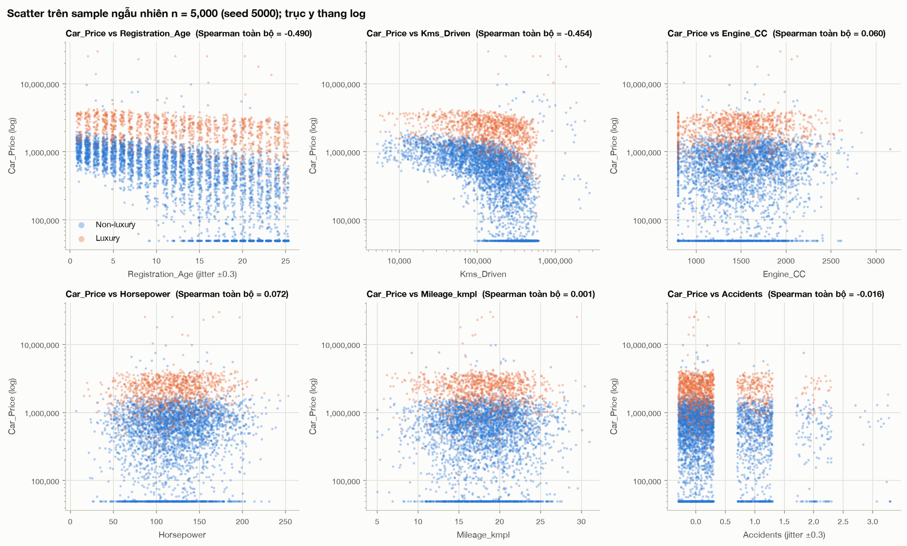
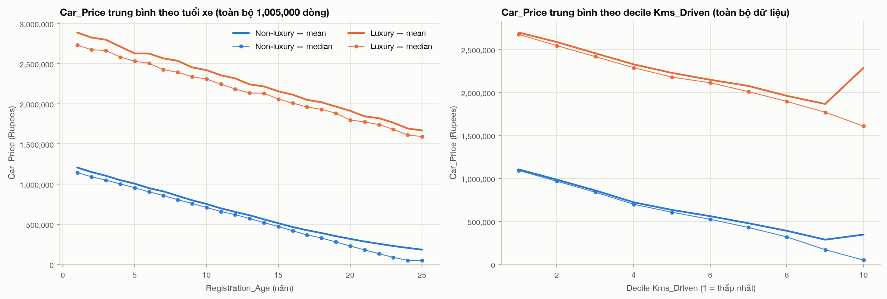

- **Số liệu.**
  - Theo tuổi xe, **median giá giảm đều**: Luxury từ 2,731,886 (1 tuổi) xuống 1,592,775 (25 tuổi); Non-luxury từ 1,145,485 xuống 50,000, chạm giá sàn từ tuổi 24.
  - Theo decile Kms, xu hướng tương tự. Riêng decile 10 có **mean** Luxury tăng vọt lên 2,286,642 do nhóm implausible, trong khi **median** vẫn tiếp tục giảm.
  - Scatter cho thấy rõ 3 cấu trúc: dải giá sàn ở 50,000, hai cụm giá tách biệt theo segment, và nhóm bất thường ở góc phải của biểu đồ Kms.
- **Hệ quả.** Nên trình bày **median theo nhóm**, vì median bền với cả giá sàn lẫn dòng lỗi. Nếu dùng scatter thì phải nói rõ n và seed.

### 6.4 Crosstab giữa các biến categorical *(`tables/05f_*.csv`; fig_05d)*

| Crosstab (row %) | Chênh lệch lớn nhất giữa các hàng |
|---|---:|
| Segment × Fuel_Type | 0.08 điểm % |
| Segment × Transmission | 0.12 |
| Segment × Owner_Type | 0.09 |
| Segment × City | 0.09 |
| Segment × Color | 0.13 |
| Fuel_Type × Transmission | 0.38 |
| City × Fuel_Type | 0.33 |
| Brand × Fuel_Type | 1.04 |

- **Diễn giải.** Các biến categorical **độc lập với nhau** và độc lập với segment. Ví dụ, Luxury có 41.16% Petrol, Non-luxury có 41.23%.
- **Hệ quả.** Không có confounding giữa các biến categorical và segment. Không cần lo multicollinearity giữa các biến dummy.

---

## 7. Phân tích biến mục tiêu Car_Price *(script: `06_target_price.py`; bảng: `tables/06*.csv`)*

### 7.1 Car_Price gốc vs log(Car_Price)

| View | n | Mean | Median | Mean/Median | Skew (price) | Kurt (price) | Skew (log) | Kurt (log) |
|---|---:|---:|---:|---:|---:|---:|---:|---:|
| all | 1,005,000 | 1,012,897 | 758,908 | 1.335 | **6.99** | 116.5 | −0.73 | −0.15 |
| clean | 990,395 | 966,823 | 753,706 | 1.283 | **2.06** | 21.1 | −0.79 | −0.21 |
| clean_nofloor | 874,592 | 1,088,218 | 852,711 | 1.276 | 2.18 | 24.7 | −0.54 | 0.26 |

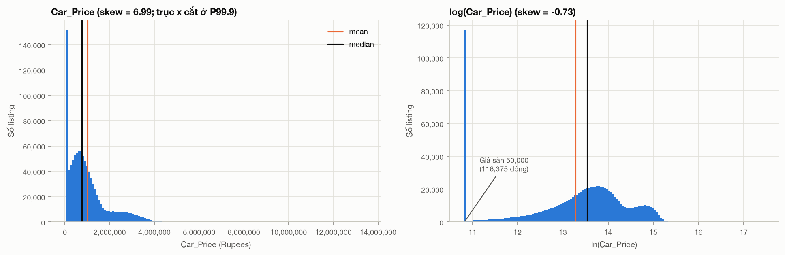

- **Diễn giải.**
  - Phần lớn độ lệch cực đoan (6.99) đến từ nhóm implausible. Bỏ nhóm này thì skew còn 2.06.
  - Log làm phân phối **lệch trái nhẹ** (−0.79). Nguyên nhân là giá sàn tạo một cột ở ln(50,000) = 10.82, và phân phối có hai "bướu" theo segment.
- **Trả lời câu hỏi Guide A(iv).** Mean cao hơn median 28–34%, nghĩa là phân phối lệch phải. Nên báo cáo **median** cho khách hàng, vì mean bị kéo lên bởi xe Luxury giá cao và các giá trị cực đoan.
- **Hệ quả.** Có dùng log(price) cho M2 hay không cần cân nhắc theo Mục 7.3: log giúp giảm skew, nhưng quan hệ giá–tuổi lại tuyến tính theo *Rupees* chứ không phải theo *%*.

### 7.2 Price theo biến categorical (median; view clean, trong từng segment)

| Biến | Tỉ số median max/min trong Luxury | Tỉ số median max/min trong Non-luxury | Nhận xét |
|---|---:|---:|---|
| **Brand** | 1.20 (Audi 1.98M → Mercedes 2.39M) | 1.66 (Tata 447k → Volkswagen 741k) | khác biệt thật |
| Model | 1.22 | 1.69 | gần như chỉ phản ánh Brand (trong cùng Brand ≤ 1.03) |
| **Accidents** (0 → 2 vụ) | −1.1% mỗi vụ | −3.9% mỗi vụ | khoảng **−23–24k Rs mỗi vụ ở cả hai segment** |
| **Service_History** (0 → 1) | +2.2% | +9.0% | khoảng **+47–49k Rs ở cả hai segment** |
| Fuel_Type, Transmission, Owner_Type, Color, City, Seats, Doors, Insurance, Tax | ≤ 1.016 | ≤ 1.013 | **không khác biệt** (≤ 1.6%) |

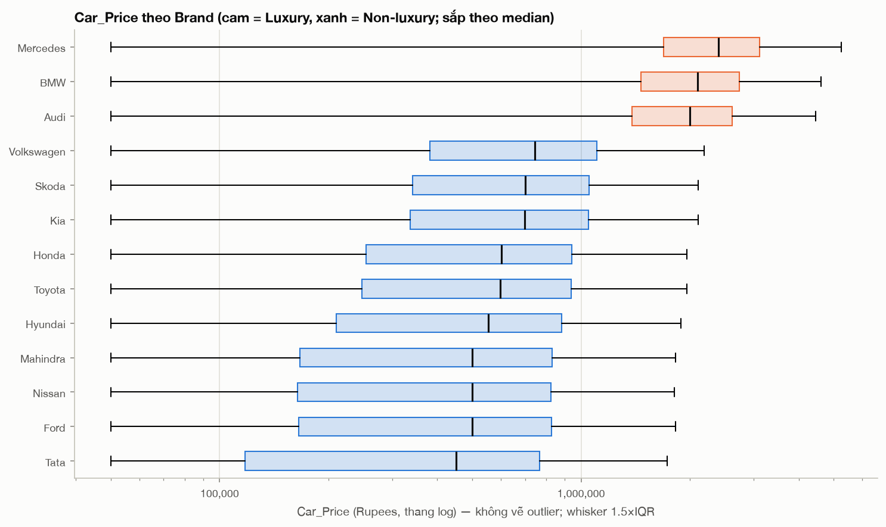
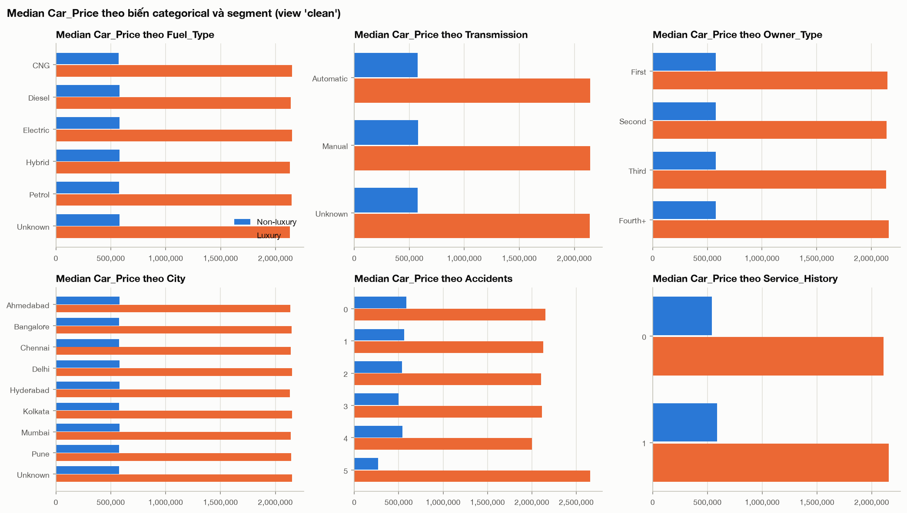

- **Diễn giải.** Ngoài Brand/Segment, tuổi xe và Kms, chỉ có Accidents và Service_History liên quan tới giá. Mức tác động tính theo **Rupees** gần như giống nhau ở hai segment, nhưng tính theo % thì lớn hơn ở Non-luxury, vì giá nền của Non-luxury thấp hơn.
- **Lưu ý về cỡ mẫu.** Nhóm 4–5 tai nạn chỉ có 3–166 dòng, nên các median ở nhóm này không ổn định.

### 7.3 Trọng tâm: Luxury vs Non-luxury

| View clean | n | Mean | Median | SD | CV | P10 | Q1 | Q3 | P90 | % giá sàn |
|---|---:|---:|---:|---:|---:|---:|---:|---:|---:|---:|
| **Luxury** | 228,820 | 2,158,607 | **2,143,644** | 903,698 | 0.42 | 1,031,075 | 1,499,809 | 2,798,125 | 3,297,678 | 0.05% |
| **Non-luxury** | 761,575 | 608,744 | **577,741** | 440,220 | 0.72 | 50,000 | 228,109 | 916,992 | 1,209,766 | 15.19% |
| Tỉ số Lux/Non | | 3.55 | **3.71** | | | | | | | |

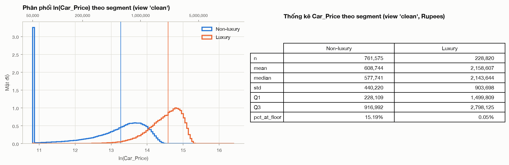

- **Mức giá.**
  - Median Luxury gấp **3.71 lần** (chênh 1.57M Rs). Tỉ số này **ổn định** ở mọi view: all 3.71, clean 3.71, sau khi bỏ NaN/Unknown 3.71. Chỉ khi bỏ giá sàn thì tỉ số giảm còn 3.18.
  - Hai phân phối chồng lấn ít: 18.3% xe Non-luxury có giá cao hơn P10 của Luxury (1,031,075).
  - Non-luxury biến động tương đối lớn hơn (CV 0.72 so với 0.42).
- **Quan hệ giá với các biến khác, theo từng segment (view clean):**

| | Luxury | Non-luxury |
|---|---:|---:|
| Pearson(price, Registration_Age) | −0.383 | **−0.689** |
| Spearman(price, Registration_Age) | −0.385 | **−0.713** |
| Pearson(price, Kms_Driven) | −0.368 | **−0.638** |
| Độ dốc trendline, **Rupees / năm tuổi** | **−47,986** | **−42,037** (−35,707 nếu bỏ giá sàn) |
| Độ dốc trendline, **% / năm tuổi** (log) | **−2.7%** | **−9.8%** (−6.1% nếu bỏ giá sàn) |
| Độ dốc, Rupees / 10,000 km | −24,058 | −20,310 |
| Độ dốc, % / 10,000 km (log) | −1.5% | −5.2% |
| Spearman(price, Kms) *trong cùng một tuổi*, trung bình 25 nhóm tuổi | −0.11 | −0.23 |
| Chỉ số median giá ở tuổi 25 (tuổi 1 = 100) | **58** | **4** |

*(Độ dốc trendline là đường least squares **thuần mô tả**, giống trendline trong Excel. Đây chưa phải mô hình suy luận.)*

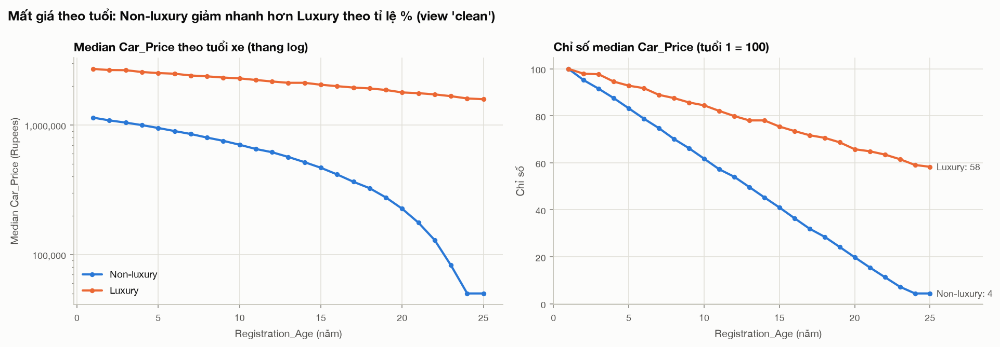

- **Diễn giải. Có interaction effect hay không phụ thuộc vào thang đo:**
  - **Theo Rupees:** mỗi năm tuổi làm giá giảm gần như **bằng nhau** ở hai segment. Fit trên median theo tuổi (Mục 8) cho −48,047 (Luxury) và −48,072 (Non-luxury), R² ≥ 0.997. Khoảng cách giữa hai segment giữ ổn định ở khoảng 1.53–1.59M Rs ở mọi độ tuổi. Nói cách khác, segment chỉ cộng thêm một khoản premium cố định, **không có interaction**.
  - **Theo %:** Non-luxury mất giá nhanh hơn khoảng 3–4 lần (−7.6% so với −2.1%/năm theo median). **Có interaction mạnh.**
  - Correlation ở Non-luxury mạnh hơn không phải vì giá giảm dốc hơn, mà vì giá nền thấp hơn. Cùng một mức giảm 48k chiếm tỉ trọng lớn hơn trong độ phân tán của giá Non-luxury.
  - Kms vẫn còn quan hệ với giá **sau khi cố định tuổi xe** (−0.11 và −0.23), nên Kms mang thêm thông tin ngoài tuổi.
- **Hệ quả cho M2.** Cần kiểm định interaction *Segment × Registration_Age* trên **cả hai thang đo** (price và log(price)), và chọn thang đo trước khi diễn giải. Giá sàn làm độ dốc của Non-luxury trông thoải hơn (−42k thay vì −48k), nên cũng cần kiểm tra độ nhạy theo giá sàn.

---

## 8. Phân tích theo nhóm và thời gian *(script: `07_groups_time.py`; bảng: `tables/07*.csv`)*

**City (view clean).**
- *Số liệu:* 8 city, mỗi city 11.45–11.54% số listing; Unknown 8.0%. Median giá **750,335–756,563 (chênh 0.83%)**. % Luxury 23.03–23.23%.
- *Diễn giải:* City không có vai trò gì với giá.
- *Hệ quả:* có thể bỏ City khỏi mô hình giá. Đây cũng là một hạn chế nên nêu ra: dữ liệu không phản ánh chênh lệch giá theo vùng.

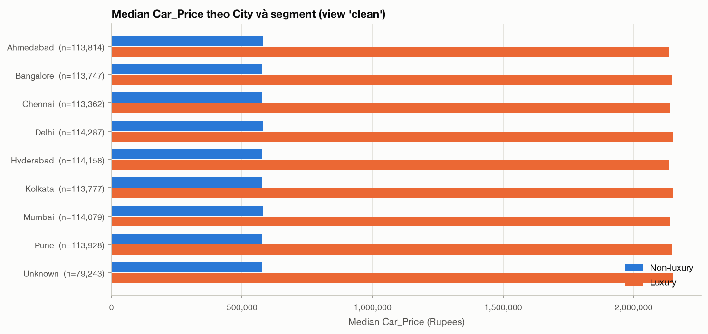

**Brand (median, view clean).**

| Mercedes | BMW | Audi | Volkswagen | Skoda | Kia | Honda | Toyota | Hyundai | Mahindra | Ford | Nissan | Tata |
|---:|---:|---:|---:|---:|---:|---:|---:|---:|---:|---:|---:|---:|
| 2,388,608 | 2,087,018 | 1,984,634 | 740,750 | 696,932 | 692,867 | 597,538 | 594,584 | 550,314 | 496,918 | 496,303 | 496,176 | 447,228 |

- **Số liệu.**
  - **Hai segment không chồng lấn ở cấp Model:** model Luxury rẻ nhất (Audi Q5, median 1,979,507) vẫn đắt hơn model Non-luxury đắt nhất (VW Taigun, 748,153) tới 2.6 lần.
  - Trong cùng Brand, median giữa các Model chênh ≤ 2.8%.
  - Trong Non-luxury, các Brand vẫn khác nhau tới 1.66 lần.
- **Hệ quả.** Segment là một cách tóm tắt tốt, nhưng dùng **Brand** sẽ giải thích thêm được một phần chênh lệch trong nhóm Non-luxury.

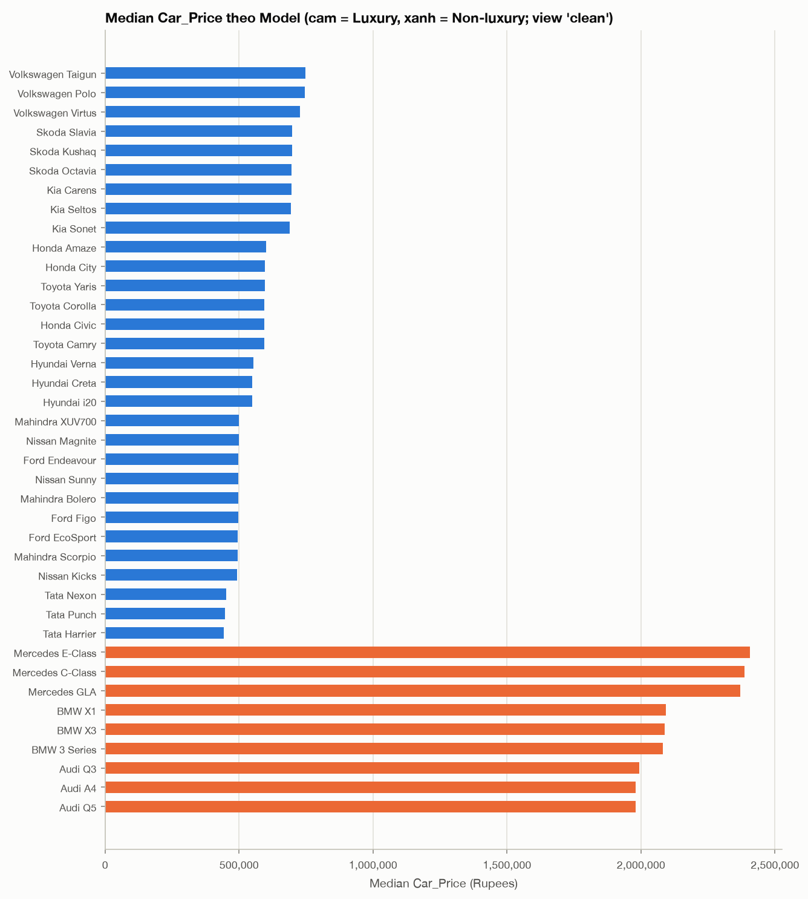

**Thời gian / tuổi xe.**
- Số listing theo năm sản xuất gần như bằng nhau: 39,871–40,563 mỗi năm, CV = 0.005.
- Đường thẳng mô tả fit trên **median giá theo tuổi** (mỗi tuổi 1 điểm):

| Segment | Tuổi | Rupees / năm | R² | % / năm (log) | Median tuổi 1 | Median tuổi 20 / 25 |
|---|---|---:|---:|---:|---:|---:|
| Luxury | 1–20 | **−48,047** | 0.997 | −2.1% | 2,715,832 | 1,786,548 |
| Non-luxury | 1–20 | **−48,072** | 1.000 | −7.6% | 1,140,658 | 225,632 |
| Luxury | 1–25 | −47,725 | 0.998 | −2.2% | | 1,583,530 |
| Non-luxury | 1–25 | −47,358 | 0.999 | −11.2% | | 50,000 (sàn) |

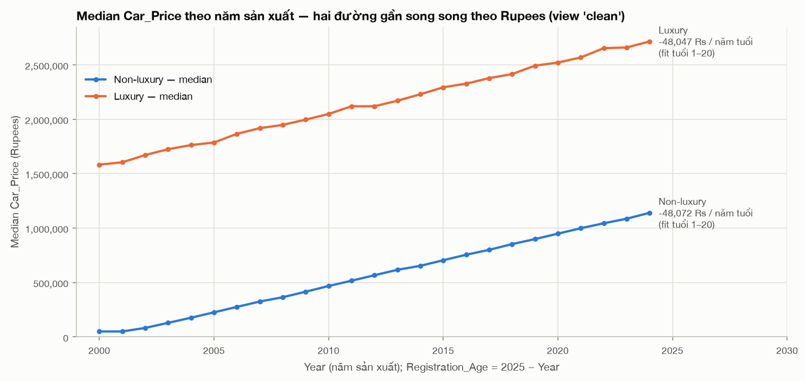

- **Diễn giải.** Theo Rupees, giá giảm **tuyến tính gần như hoàn hảo**, và **hai đường song song**.
- **Kms theo tuổi.** Median Kms/tuổi ≈ 15,000 ở mọi độ tuổi (15,112 ở tuổi 1, 15,068 ở tuổi 25), nên Kms tăng tuyến tính theo tuổi (fig_07d).
- **Các biến khác.** Owner_Type không liên quan tới tuổi xe (tuổi trung bình 13.0 ở mọi nhóm). Accidents cũng gần như không (13.0–13.2 với 0–3 vụ).

---

## 9. Tính đại diện và thiên lệch *(script: `08_representativeness.py`; bảng: `tables/08*.csv`)*

**Phân bố mẫu.**
- **Số liệu.**
  - Segment: Non-luxury 76.9%, Luxury 23.1%, tỉ lệ 3.3 : 1.
  - Brand, Model, City, Year, Color: gần như **đều tuyệt đối** (CV của số dòng ≤ 0.006; tỉ số max/min ≤ 1.02).
  - Chỉ Fuel_Type (Petrol 41% so với Hybrid 6.6%) và Owner_Type (First 60% so với Fourth+ 5%) là mất cân bằng.
- **Diễn giải.** Luxury chiếm 23.1% vì 3 trên 13 brand là Luxury và mỗi brand có số dòng như nhau. Con số này **phản ánh cách dữ liệu được tạo ra, không phải thị phần thật**.

**Missing và Unknown có gây bias không?**

| Cờ | Segment | % dòng bị ảnh hưởng | Median giá (có cờ) | Median giá (đầy đủ) | Chênh | Tuổi TB (có cờ / đầy đủ) |
|---|---|---:|---:|---:|---:|---|
| có NaN | Luxury | 22.0% | 2,144,477 | 2,159,461 | −0.69% | 13.05 / 13.01 |
| có NaN | Non-luxury | 22.2% | 580,371 | 581,859 | −0.26% | 13.00 / 13.00 |
| có Unknown | Luxury | 28.4% | 2,151,648 | 2,157,405 | −0.27% | 13.07 / 13.00 |
| có Unknown | Non-luxury | 28.2% | 580,971 | 581,769 | −0.14% | 13.00 / 13.00 |

→ **Không có dấu hiệu bias.** Missing và Unknown phân bố ngẫu nhiên.

**Cơ cấu mẫu trước và sau theo từng kịch bản loại dòng** (chỉ mô phỏng):

| Kịch bản | n | % giữ lại | % Luxury | % Non-luxury ≥ 20 tuổi | Median Lux | Median Non | Lux/Non | Spearman(giá, tuổi) | Pearson(giá, Kms) |
|---|---:|---:|---:|---:|---:|---:|---:|---:|---:|
| S0 gốc | 1,005,000 | 100% | 23.10% | 24.01% | 2,155,953 | 581,505 | 3.71 | −0.490 | −0.074 |
| S1 − duplicates | 1,000,000 | 99.50% | 23.10% | 24.01% | 2,155,976 | 581,475 | 3.71 | −0.490 | −0.074 |
| **S2 − dup − implausible (đề xuất)** | **990,395** | **98.55%** | 23.10% | 24.02% | 2,143,644 | 577,741 | 3.71 | −0.493 | **−0.335** |
| S2b − dup − Kms > 1M (Guide) | 996,113 | 99.12% | 23.10% | 23.93% | 2,151,172 | 580,925 | 3.70 | −0.494 | −0.211 |
| S3 = S2 − NaN/Unknown (listwise) | 553,228 | **55.05%** | 23.10% | 23.95% | 2,147,937 | 578,511 | 3.71 | −0.493 | −0.336 |
| S4 = S2 − giá sàn | 874,592 | 87.02% | **26.15%** | **15.83%** | 2,144,298 | **674,814** | **3.18** | **−0.365** | −0.212 |

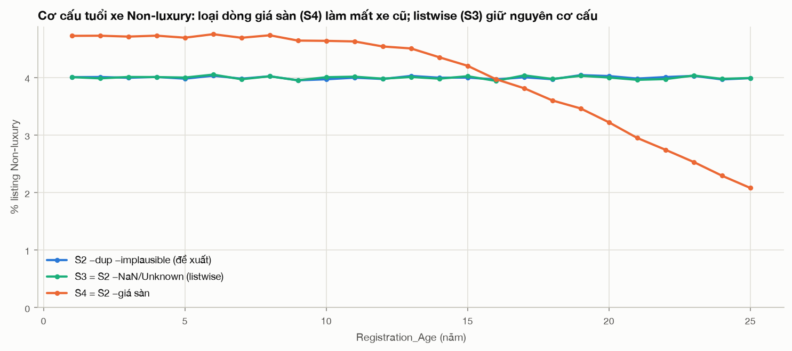

- **Diễn giải.**
  - **S2** loại 1.45% số dòng và giữ nguyên cơ cấu mẫu, nhưng làm lộ ra quan hệ giá–Kms.
  - **S3** mất 45% dữ liệu mà không thay đổi kết luận nào, nên là lãng phí.
  - **S4** gây **bias có hệ thống**: xóa có chọn lọc xe Non-luxury cũ. Tỉ trọng xe ≥ 20 tuổi giảm từ 24.0% xuống 15.8%, median Non-luxury tăng 17%, khoảng cách giữa hai segment bị thu hẹp (3.71 → 3.18), và quan hệ giá–tuổi bị làm yếu (−0.49 → −0.37).
- **Hạn chế về khả năng khái quát hóa** (dùng cho Objective 2).
  1. Cơ cấu brand, city, năm sản xuất đều tuyệt đối, không phản ánh thị phần thật, nên các con số trung bình toàn mẫu (ví dụ "median 758,908") phụ thuộc vào cách lấy mẫu.
  2. Chỉ có 8 city, 13 brand, 39 model, xe từ 2000–2024. Không suy rộng được cho brand hay model ngoài danh sách này.
  3. Giá dưới 50,000 bị chặn, nên không mô tả được phân khúc xe rất rẻ.
  4. Không có ngày đăng tin (mọi xe quy về năm 2025), nên không phân tích được xu hướng thị trường theo thời gian.
  5. Nhiều đặc tính hầu như không liên quan tới giá (Fuel, Transmission, City…). Đây là điều bất thường nếu so với trực giác, và có thể là đặc điểm của dữ liệu mô phỏng. Tôi không dùng kiến thức ngành để khẳng định điều này; chỉ ghi nhận rằng *trong dữ liệu này* các biến đó không có tác dụng.
  6. Nếu dùng bản đã randomize, các quan hệ ở trên có thể không còn (xem mục quyết định số 1).

---

## 10. Ghi nhận cách xử lý dữ liệu — Data Issue Log *(script: `09_issue_log.py`; `tables/09_data_issue_log.csv`)*

Mọi con số trong bảng dưới đây do script tính lại từ dữ liệu. Đây là **ĐỀ XUẤT**: chưa có thay đổi nào được áp dụng.

| # | Vấn đề | Cột liên quan | Bằng chứng (số dòng, %) | Cách xử lý đề xuất | Phương án thay thế | Lý do (justification) | Ảnh hưởng đến phân tích |
|---|---|---|---|---|---|---|---|
| 1 | File chưa được randomize (macro Workbook_Open chưa chạy) | Sheet Dataset!B6; Mileage_kmpl, Engine_CC, Horsepower, Kms_Driven, Car_Price | B6 trống; người lưu cuối là giảng viên. Macro sẽ ghi đè 5 cột bằng giá trị mô phỏng (Cholesky + Cornish-Fisher/lognormal). | Quyết định dùng file nào trước khi viết báo cáo. Nếu randomize: mở bằng Excel (Enable Content), lưu .xlsm, chạy lại toàn bộ scripts với EDA_XLSM=<file mới>. | Giữ file hiện tại và ghi rõ trong báo cáo rằng dữ liệu chưa randomize. | Slide intro yêu cầu mỗi sinh viên làm trên bản đã randomize; số liệu của 5 cột (gồm cả target) sẽ khác hoàn toàn. | Toàn bộ thống kê về Car_Price, Kms_Driven, Engine_CC, Horsepower, Mileage_kmpl. |
| 2 | Nhãn Brand có khoảng trắng thừa | Brand | 13 biến thể (ví dụ ' BMW '), 10,040 dòng (0.999%); 2,334 dòng Audi/BMW/Mercedes sẽ bị xếp nhầm Non-luxury nếu không TRIM. | TRIM Brand rồi gán Segment (Luxury = Audi, BMW, Mercedes). | Không có, bắt buộc phải làm. | Guide yêu cầu làm sạch Brand trước khi tạo segment; các biến thể chỉ khác khoảng trắng, không mơ hồ. | Cỡ nhóm Luxury: 22.869% → 23.102%. |
| 3 | Nhãn Fuel_Type không thống nhất (hoa/thường, khoảng trắng, typo) | Fuel_Type | 6 biến thể, 20,123 dòng (2.002%): trim/case 13,431 (' Diesel', 'diesel ', 'petrol', 'PETROL'); typo 6,692 ('hybridd'→Hybrid, 'electrik'→Electric). | TRIM + chuẩn hóa hoa/thường; gộp 'hybridd'→Hybrid, 'electrik'→Electric (12 nhãn → 6). | Giữ typo thành nhóm riêng, hoặc gộp vào 'Unknown'. | Mỗi typo chỉ khác nhãn chuẩn 1 ký tự (độ giống difflib ≥ 0.88) và không trùng với nhãn hợp lệ nào khác. | Tần suất Fuel_Type chính xác; ảnh hưởng tới giá rất nhỏ (median theo Fuel trong từng segment chênh ≤ 1.3%). |
| 4 | Giá trị 'Unknown' trong biến categorical | Fuel_Type, Transmission, Color, City | Fuel_Type 7.834%, Transmission 7.999%, Color 8.002%, City 8.003%; 283,648 dòng (28.224%) có ≥ 1 'Unknown'; không có biến thể khác ('N/A', '-', ''); % Unknown giữa các nhóm chênh ≤ 0.67 điểm %; median giá chênh 0.26%. | Giữ 'Unknown' là một nhóm riêng; không xóa, không impute. | Listwise deletion (xóa dòng) hoặc impute bằng mode. | Phân bố gần như ngẫu nhiên (MCAR-like) và không liên quan tới giá; xóa sẽ mất nhiều dòng mà không đổi kết quả. | Bảng tần suất và crosstab có thêm cột 'Unknown'; các biến này hầu như không liên quan tới giá. |
| 5 | Missing values (ô trống) ở biến numeric | Mileage_kmpl, Engine_CC, Horsepower | Mileage_kmpl 80,390 (7.999%), Engine_CC 80,403 (8.0%), Horsepower 80,403 (8.0%); 222,503 dòng (22.14%) có ≥ 1 NaN; thiếu cả 3 cột: 515 dòng, so với kỳ vọng 515 nếu độc lập; % missing giữa các nhóm chênh ≤ 0.67 điểm %; median giá chênh 0.30%. | Giữ dòng; dùng pairwise deletion (bỏ ô trống riêng cho từng thống kê, Excel làm như vậy mặc định). Không impute ở M1. | Impute median (theo Model) cho mô hình ở final report; hoặc dùng complete-case chỉ khi mô hình có các biến này. | Missing độc lập giữa các cột và với nhóm/giá (MCAR-like); các biến này tương quan rất yếu với giá (\|r\| ≤ 0.06). | Listwise deletion NaN + Unknown sẽ bỏ 443,543 dòng (44.134%) mà median giá gần như không đổi. |
| 6 | Exact duplicated records | Tất cả 20 cột | 10,000 dòng thuộc 5,000 cặp trùng hoàn toàn; 5,000 bản sao thừa (0.498%); bỏ bản sao còn đúng 1,000,000 dòng; không có near-duplicate (trùng mọi cột trừ Car_Price). | Xóa bản sao thừa (giữ lần xuất hiện đầu). | Giữ nguyên (ảnh hưởng tới thống kê < 0.01%). | Trùng cả 5 biến số thực nhiều chữ số thập phân nên gần như không thể là ngẫu nhiên; một listing không nên được đếm 2 lần. | Median giá thay đổi < 0.01%; n = 1,000,000. |
| 7 | Kms_Driven phi lý: km/năm vượt biên của phần thân dữ liệu | Kms_Driven, Registration_Age, Car_Price | 99.042% dòng có Kms/Registration_Age trong [5,000; 25,000]; 9,623 dòng (0.958%) vượt 25,000 km/năm, gồm toàn bộ 3,908 dòng Kms > 1,000,000; giá các dòng này cao gấp 4.76 lần (median) xe cùng Model và tuổi; chiếm 81.516% outlier giá > 3×IQR. | Loại khỏi phân tích quan hệ giá (hoặc gắn cờ và báo cáo cả hai kết quả). | Chỉ loại Kms > 1,000,000 theo ví dụ trong Guide (3,908 dòng); cách này bỏ sót 5,715 dòng cùng kiểu bất thường. | Nhóm này tách rời khỏi phân phối (điểm gãy rõ trên fig_04c/fig_04d), phân bố đều theo tuổi xe và segment, và giá bị phóng đại đồng thời. Đây là dấu hiệu dữ liệu lỗi, không phải xe thật. | Pearson(Car_Price, Kms_Driven): toàn bộ −0.074; chỉ bỏ Kms > 1M: −0.211; bỏ theo km/năm: −0.335. Skewness giá 6.99 → 2.06 (bỏ duplicates + implausible). |
| 8 | Horsepower ≤ 0 | Horsepower (Engine_CC) | 32 dòng (0.003%), min = −18.51; median Engine_CC của các dòng này = 800 (đúng giá trị sàn). | Coi Horsepower của các dòng này là missing (giữ các cột khác). | Xóa 32 dòng (không đáng kể). | Công suất âm hoặc bằng 0 là vô nghĩa về logic; các cột khác của dòng vẫn hợp lệ. | Không đáng kể (0.003%). |
| 9 | Car_Price bị chặn sàn (censoring) tại giá trị min | Car_Price | 116,375 dòng (11.58%) có Car_Price = 50,000; Non-luxury 15.044% so với Luxury 0.049%; 55.234% ở xe Non-luxury 25 tuổi; tăng theo tuổi và Kms. | Giữ lại, gắn cờ "giá sàn"; báo cáo median; ở M2 và final kiểm tra độ nhạy (có và không có nhóm này). | Loại nhóm giá sàn (KHÔNG khuyến nghị), hoặc chỉ phân tích xe ≤ 20 tuổi. | Giá thật ≤ 50,000 nhưng không biết chính xác; xóa sẽ loại có chọn lọc xe cũ Non-luxury (bias). | Nếu xóa: median Non-luxury 577,741 → 674,814; tỉ số median Luxury/Non-luxury 3.71 → 3.18; quan hệ giá–tuổi bị làm yếu. |
| 10 | Engine_CC và Mileage_kmpl bị chặn sàn | Engine_CC, Mileage_kmpl | Engine_CC = 800: 37,028 dòng (4.005% số giá trị có); Mileage_kmpl = 5: 516 dòng. | Giữ, gắn cờ; lưu ý mode trùng giá trị sàn nên mode không có ý nghĩa mô tả. | Coi giá trị sàn là missing. | Point mass tại min là dấu hiệu bị chặn, không phải giá trị đo thật; các biến này tương quan rất yếu với giá. | Mode của Engine_CC và Mileage_kmpl phản ánh giá trị sàn, không phải giá trị điển hình. |
| 11 | Registration_Age trùng thông tin với Year | Year, Registration_Age | Year + Registration_Age = 2025 ở 100.0% dòng (r = −1.000). | Chỉ dùng Registration_Age (biến Guide chỉ định) trong phân tích và mô hình. | Chỉ dùng Year. | Hai biến là biến đổi tuyến tính của nhau, nên multicollinearity là hoàn hảo. | Không thể đưa cả hai vào cùng một mô hình hồi quy. |
| 12 | Multicollinearity giữa các biến giải thích | Engine_CC–Horsepower; Registration_Age–Kms_Driven | r(Engine_CC, Horsepower) = 0.839; r(Registration_Age, Kms_Driven) = 0.642 (Spearman 0.813); median Kms ≈ 15,000 × tuổi. | Ghi nhận; ở M2 và final chọn một trong hai biến Engine_CC/Horsepower; diễn giải hệ số của tuổi và Kms thận trọng. | Tạo biến km/năm để tách phần Kms không do tuổi. | Hệ số hồi quy không ổn định khi các biến giải thích tương quan mạnh. | Ảnh hưởng tới mô hình ở final report, không ảnh hưởng tới thống kê mô tả. |
| 13 | Giá cực cao nhưng có thể hợp lệ | Car_Price | 1,079 dòng > 3×IQR không vi phạm quy tắc nào; 85.728% là Luxury. | Giữ; đánh giá outlier TRONG từng segment. | Winsorize ở P99.9 để kiểm tra độ nhạy. | Median Luxury cao gấp 3.71 lần Non-luxury, nên fence 1.5×IQR của toàn mẫu gắn nhầm xe Luxury là outlier. | Mean của Luxury nhạy với nhóm này; nên báo cáo median. |
| 14 | Phân bố mẫu đồng đều bất thường (tính đại diện) | Brand, Model, City, Year | Mỗi brand 7.66–7.72%; mỗi city (trừ Unknown) 11.44–11.54%; mỗi năm sản xuất 3.97–4.04%; Luxury = 23.102%. | Không xử lý; nêu trong phần hạn chế (Objective 2). | Gán trọng số (weighting) nếu có dữ liệu cơ cấu thị trường thật (ngoài phạm vi M1). | Cơ cấu đều tuyệt đối gợi ý dữ liệu được sinh ra hoặc lấy mẫu phân tầng, không phản ánh tỉ trọng thị trường thực. | Kết quả đúng cho mẫu này; khái quát hóa ra thị trường thật cần thận trọng. |

### Gợi ý hypothesis / inferential question cho M2 (rút ra từ EDA)

| # | Câu hỏi | Bằng chứng từ EDA | Cách kiểm định gợi ý (M2) |
|---|---|---|---|
| H1 | Mean Car_Price của Luxury có cao hơn Non-luxury không? | Median gấp 3.71 lần, ổn định ở mọi view (Mục 7.3) | Kiểm định hai mẫu cho hiệu hai mean (one-tailed), trên price và log(price) |
| H2 | Car_Price có quan hệ âm với Registration_Age không, xét trong từng segment? | Spearman −0.38 (Lux) / −0.71 (Non); median giảm khoảng 48k Rs mỗi năm (Mục 7–8) | Kiểm định hệ số tương quan hoặc độ dốc (slope) bằng 0 |
| H3 | Tốc độ mất giá theo tuổi có khác nhau giữa hai segment không (**interaction** Segment × Age)? | Theo Rupees: −48,047 vs −48,072 mỗi năm, gần bằng nhau. Theo %: −2.1% vs −7.6%/năm, khác nhau nhiều (Mục 7.3) | Kiểm định hiệu hai slope trên **cả** price và log(price); chọn thang đo trước khi diễn giải |
| H4 | Sau khi đã tính tới tuổi xe, Kms_Driven có còn liên quan tới giá không? | Spearman trong cùng một tuổi: −0.11 (Lux) / −0.23 (Non); r(Age, Kms) = 0.64 (Mục 6–7) | Hồi quy bội price ~ Age + Kms (hoặc km/năm); kiểm định hệ số của Kms |
| H5 | Accidents và Service_History có làm thay đổi mean price không? | Khoảng −23–24k Rs mỗi vụ tai nạn; khoảng +47–49k Rs khi có service history, ở cả hai segment (Mục 7.2) | Kiểm định hiệu hai mean (Service 0/1); so sánh mean giữa các nhóm Accidents (gộp nhóm ≥ 3) |
| H6 | Fuel_Type, Transmission, Owner_Type, City, Color có liên quan tới giá không? (dự kiến là KHÔNG) | Median chênh ≤ 1.6% trong từng segment (Mục 7.2, 8) | Kiểm định hiệu các mean; nếu không bác bỏ được H0 thì có cơ sở loại các biến này khỏi mô hình |

**Phác thảo kế hoạch cho M2 và final.**
1. Áp dụng các xử lý đã được bạn chấp nhận ở bảng trên.
2. Kiểm định H1–H6. Với H3, làm trên cả hai thang đo.
3. Xây mô hình giá với các biến: Segment (hoặc Brand), Registration_Age, Kms_Driven (hoặc km/năm), Accidents, Service_History; có thể thêm Segment × Age.
4. Kiểm tra độ nhạy của kết quả theo giá sàn và theo quy tắc loại dòng implausible.
5. Objective 2: nêu hạn chế (giá sàn, mẫu đều bất thường, không có ngày đăng tin), và đề xuất cách tốt hơn (mô hình cho dữ liệu censored, bổ sung dữ liệu về thời điểm giao dịch và vùng).

---

## Tóm tắt 5–8 phát hiện chính

1. **Dữ liệu chưa được randomize.**
   - *Số liệu:* ô B6 trống; macro sẽ ghi đè 5 cột, gồm cả Car_Price.
   - *Diễn giải:* mọi con số về giá trong báo cáo này chỉ đúng với file gốc.
   - *Hệ quả:* cần quyết định dùng file nào trước khi viết báo cáo nộp.
2. **Segment là yếu tố quyết định mức giá.**
   - *Số liệu:* median Luxury 2,143,644 so với Non-luxury 577,741 (gấp 3.71 lần), ổn định ở mọi cách làm sạch. Hai segment có hồ sơ xe giống hệt nhau (tuổi, km, engine… mean chênh ≤ 0.2%). Model Luxury rẻ nhất vẫn đắt gấp 2.6 lần model Non-luxury đắt nhất.
   - *Diễn giải:* chênh lệch giá không bị nhiễu bởi biến nào khác.
   - *Hệ quả:* đây là nền tảng rõ ràng cho H1 ở M2.
3. **Giá giảm tuyến tính theo tuổi, khoảng 48,000 Rs mỗi năm, ở CẢ HAI segment.**
   - *Số liệu:* R² ≥ 0.997 trên các median theo tuổi. Theo %: Luxury −2.1%, Non-luxury −7.6% mỗi năm.
   - *Diễn giải:* có interaction hay không **phụ thuộc vào thang đo** (Rupees hay %).
   - *Hệ quả:* H3 phải được kiểm định trên cả price và log(price).
4. **Có 0.96% dòng "phi lý" với Kms và giá bị phóng đại đồng thời.**
   - *Số liệu:* 9,623 dòng có km/năm > 25,000. Giá của chúng gấp 4.76 lần xe cùng Model và tuổi. Nhóm này chiếm 81.5% outlier giá.
   - *Diễn giải:* các dòng này che gần hết quan hệ giữa giá và Kms (Pearson −0.074, thành −0.335 sau khi loại).
   - *Hệ quả:* quy tắc > 1M km của Guide chỉ bắt được 41% số dòng này.
5. **Car_Price bị chặn sàn ở 50,000 với 11.6% số dòng, tập trung ở xe Non-luxury cũ.**
   - *Số liệu:* 15.0% Non-luxury so với 0.05% Luxury; 55% ở xe Non-luxury 25 tuổi.
   - *Diễn giải:* xóa các dòng này sẽ gây bias (median Non-luxury +17%, tỉ số 3.71 → 3.18).
   - *Hệ quả:* giữ lại, gắn cờ, và kiểm tra độ nhạy.
6. **Missing (khoảng 8% mỗi cột) và 'Unknown' (khoảng 8% mỗi cột) đều ngẫu nhiên.**
   - *Số liệu:* 515 dòng thiếu cả 3 cột, đúng bằng kỳ vọng 514; median giá chênh ≤ 0.7%.
   - *Diễn giải:* listwise deletion sẽ mất 44% dữ liệu mà kết luận không đổi.
   - *Hệ quả:* giữ lại; dùng pairwise deletion hoặc coi 'Unknown' là một nhóm.
7. **Các lỗi nhãn và duplicates nhỏ nhưng bắt buộc phải xử lý.**
   - *Số liệu:* 2,334 xe Luxury bị ẩn dưới nhãn có khoảng trắng; 12 nhãn Fuel quy về 6; 5,000 cặp duplicate, bỏ bản sao còn đúng 1,000,000 dòng.
   - *Hệ quả:* TRIM Brand trước khi tạo Segment, và xóa bản sao duplicate.
8. **Chỉ vài biến có liên quan tới giá.**
   - *Số liệu:* tuổi xe, Kms, Brand/Segment, Accidents (khoảng −23k Rs mỗi vụ), Service_History (khoảng +48k Rs). Fuel, Transmission, Owner, City, Color, Seats, Doors, Insurance, Tax đều chênh ≤ 1.6%.
   - *Diễn giải:* có multicollinearity giữa Year và Age (r = −1), Engine và HP (0.84), Age và Kms (0.64).
   - *Hệ quả:* mô hình ở M2 có thể gọn.

---

## Những điều cần tôi quyết định

1. **File randomize hay file hiện tại?** (quan trọng nhất)
   - Hiện tại bạn chọn làm trên file **chưa randomize**. Theo slide intro, mỗi sinh viên cần làm trên bản đã randomize của chính mình.
   - Đọc mã VBA cho thấy: macro sinh lại 5 cột (Mileage, Engine, HP, Kms, **Car_Price**) từ các số ngẫu nhiên, chỉ tương quan **với nhau** theo một ma trận cố định (ví dụ giá–Kms −0.074, giá–Engine 0.037, giá–HP 0.045, Engine–HP 0.839). Các hệ số này trùng với correlation Pearson của file hiện tại. Giá mới **không phụ thuộc** Brand, Registration_Age, Accidents hay Service_History.
   - *Suy ra từ mã nguồn, chưa kiểm chứng bằng cách chạy:* sau khi randomize, chênh lệch giá theo segment và theo tuổi xe có thể **biến mất**. Giá sàn, NaN ở 5 cột và quy tắc km/năm cũng không còn.
   - Nếu bạn randomize: chạy `EDA_XLSM="…" bash scripts/run_all.sh`. Mọi bảng và hình sẽ tự cập nhật, nhưng **phần diễn giải trong báo cáo này phải viết lại**. Bạn nên hỏi giảng viên nếu còn băn khoăn.
2. **Chấp nhận bảng mapping nhãn?**
   - TRIM Brand là bắt buộc.
   - Với Fuel_Type: gộp `'hybridd'` → Hybrid và `'electrik'` → Electric, hay tách riêng / gộp vào Unknown?
3. **Duplicates:** xóa 5,000 bản sao (đề xuất) hay giữ?
4. **Quy tắc implausible cho Kms:**
   - **km/năm > 25,000** (9,623 dòng; dựa trên logic nội tại, bắt được toàn bộ nhóm bất thường), hay
   - **Kms > 1,000,000** như ví dụ trong Guide (3,908 dòng; đơn giản, dễ giải thích với người chấm)?
   - Hoặc báo cáo cả hai?
5. **Giá sàn 50,000:** giữ và gắn cờ (đề xuất), phân tích riêng xe ≤ 20 tuổi, hay loại bỏ (không khuyến nghị)?
6. **Missing / Unknown:** giữ lại, dùng pairwise deletion và coi Unknown là một nhóm (đề xuất), hay listwise deletion (mất 44%)?
7. **Horsepower ≤ 0 (32 dòng):** chuyển thành missing (đề xuất) hay xóa dòng?
8. **Thang đo cho M2:** price (Rupees, khi đó hai segment song song) hay log(price) (khi đó Non-luxury mất giá nhanh hơn)? Lựa chọn này quyết định câu chuyện về interaction.
9. **Chọn biến:** Registration_Age thay cho Year (đề xuất, vì Guide chỉ định). Chọn Engine_CC hay Horsepower. Có dùng Brand thay cho Segment trong mô hình không.

---

## Phụ lục — danh mục file

| Thư mục / file | Nội dung |
|---|---|
| `scripts/_common.py` | Hằng số, `load_raw()`, mapping nhãn, cờ implausible và giá sàn, style biểu đồ |
| `scripts/00_…09_*.py`, `scripts/run_all.sh` | Các script của 10 bước EDA, chạy độc lập hoặc chạy tuần tự bằng `run_all.sh` |
| `script_log.md` | Nhật ký: script → mục đích → kết quả → quyết định, kèm ghi chú các lỗi đã sửa |
| `logs/*.log` | Output đầy đủ của từng script; mã SHA-256 của file gốc trước và sau khi chạy |
| `tables/*.csv` | Mọi bảng số liệu (đóng vai trò "table view" cho các hình); đánh số theo script |
| `figures/fig_*.png` | 24 hình, đánh số khớp với script |
| `data_interim.parquet` (+ `.source.txt`) | Dữ liệu đã đọc nhưng **chưa làm sạch** (kèm chữ ký file nguồn) |
| `requirements.txt`, `.venv/` | Môi trường Python 3.11 |
